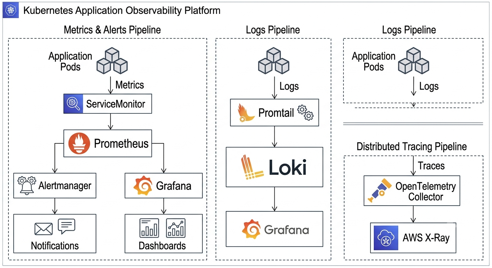

# 📊 Observability Platform


---

## Overview

This repository demonstrates a production-inspired observability platform for Kubernetes workloads using Prometheus, Grafana, Loki, Alertmanager, OpenTelemetry, and Amazon CloudWatch.

The project focuses on collecting, visualizing, and analyzing metrics, logs, and traces to improve application reliability, performance, and operational visibility.

---

# Architecture



---

## Observability Flow

Application Pods

↓

Metrics

↓

ServiceMonitor

↓

Prometheus

↓

Alertmanager

↓

Notifications

↓

Grafana Dashboards

────────────────────────

Application Pods

↓

Logs

↓

Promtail

↓

Loki

↓

Grafana

────────────────────────

Application Pods

↓

Traces

↓

OpenTelemetry Collector

↓

AWS X-Ray

---

# Features

- Prometheus Metrics Collection
- Grafana Dashboards
- Loki Log Aggregation
- Alertmanager Routing
- OpenTelemetry Collector
- ServiceMonitor Configuration
- PromQL Examples
- CloudWatch Integration
- Kubernetes Monitoring
- Production Observability Practices

---

# Repository Structure

```

observability-platform/

├── architecture/
├── docs/
├── prometheus/
├── grafana/
├── loki/
├── alertmanager/
├── otel/
├── examples/
├── assets/
├── README.md
└── LICENSE

```

---

# Documentation

| Document | Description |
|----------|-------------|
| observability-overview.md | Observability fundamentals |
| prometheus.md | Metrics collection |
| grafana.md | Dashboards and visualization |
| loki.md | Log aggregation |
| alertmanager.md | Alert routing |
| opentelemetry.md | Distributed tracing |
| servicemonitor.md | Kubernetes metrics discovery |
| promql.md | Prometheus queries |
| dashboards.md | Dashboard design |
| logging.md | Logging architecture |
| tracing.md | Tracing concepts |
| cloudwatch.md | AWS monitoring |
| security.md | Platform security |
| best-practices.md | Operational guidance |

---

# Components

- Prometheus
- Grafana
- Loki
- Alertmanager
- OpenTelemetry
- CloudWatch

---

# Future Improvements

- Tempo Integration
- SLO & Error Budget Dashboards
- Multi-cluster Monitoring
- Long-term Metrics Storage
- Alert Correlation
- Automated Dashboard Provisioning

---

# License

This project is licensed under the MIT License.